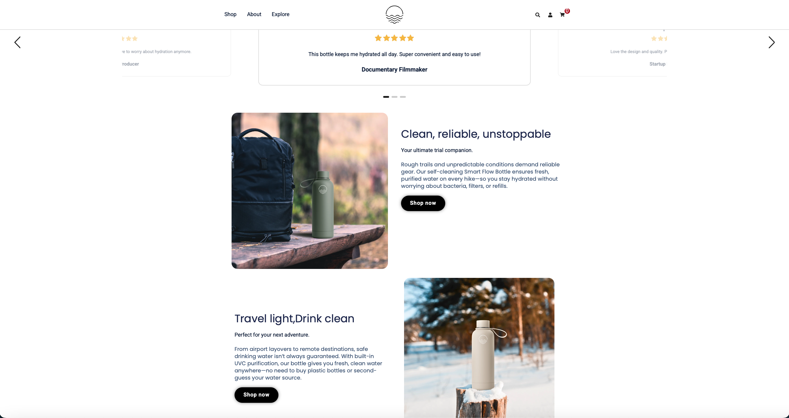
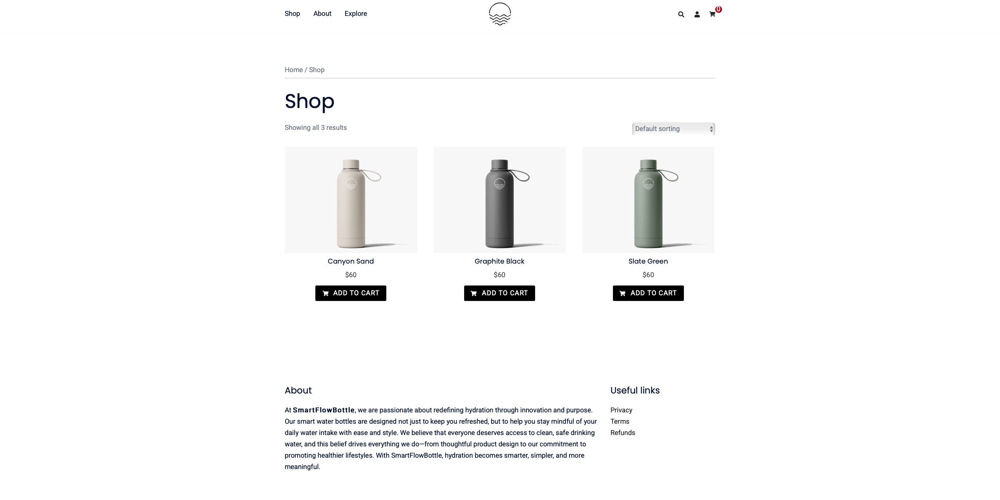

# 🚀 SmartFlow Bottle Website

A modern **WordPress-based e-commerce website** developed for a smart water bottle product using **Elementor**.
The project focuses on delivering a **clean UI/UX**, **product-centric design**, and **optimized user experience**.

---

## 📌 Project Overview

SmartFlow Bottle Website is a **product-focused web solution** designed to showcase a smart product with strong emphasis on:

* **User Experience (UX)** and intuitive navigation
* **Modern UI design principles**
* **Product branding and presentation**
* **Basic SEO optimization for visibility**

This project demonstrates the ability to build **visually appealing and conversion-focused websites** using WordPress.

---

## 🛠️ Tech Stack & Tools

* **WordPress (CMS)**
* **Elementor (Page Builder)**
* **Basic SEO Optimization**
* **LocalWP (Local Development Environment)**

---

## ✨ Key Features

* ✅ **Clean & Modern UI Design**
* ✅ **Product-Focused Layout (E-commerce style)**
* ✅ **Drag-and-Drop Development with Elementor**
* ✅ **Structured Sections for Better UX**
* ✅ **Basic On-Page SEO Implementation**
* ✅ **Smooth Navigation & Layout Flow**

---

## 📸 Screenshots

Screenshots are included in the repository to showcase different sections of the website, including:

---

## 🎥 Project Demo

A **1-minute video walkthrough** is included to demonstrate:

🔗 [Watch Demo on LinkedIn](https://www.linkedin.com/posts/ayesha-abid33_wordpress-elementor-webdevelopment-ugcPost-7453801167123542016-_iG7?utm_source=share&utm_medium=member_desktop&rcm=ACoAAFx926kBVlBwisiSg542eIFpRRKW2AFi1Io)

---

## ⚙️ Setup Instructions

1. Install WordPress
2. Upload the theme from `Theme.zip`
3. Upload plugins from `plugin.zip`
4. Activate the theme and required plugins
5. Import demo/content data (if required)

---

## 🧪 Development Note

This project was developed locally using **LocalWP** and is currently **not deployed live**.

---

## 🚀 Future Improvements

* 🔄 Full **Responsive Design Optimization**
* ⚡ Performance enhancements
* 🌐 Deployment on live hosting

---

## 👩‍💻 Author

**Ayesha Abid**
*WordPress Developer | Elementor Expert*
